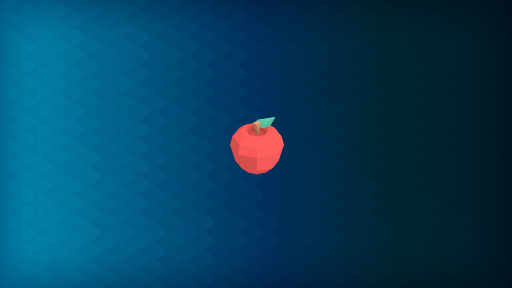
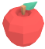
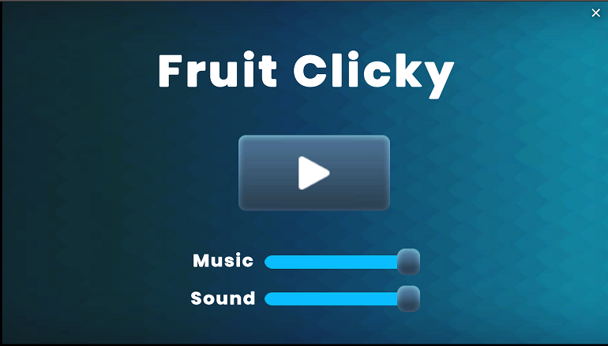
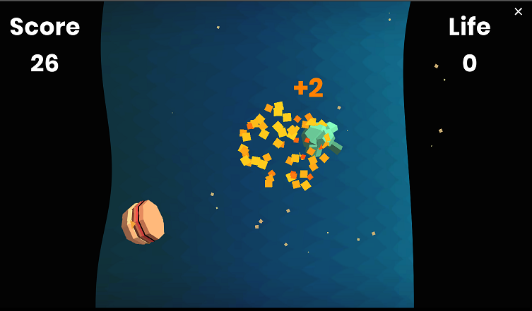
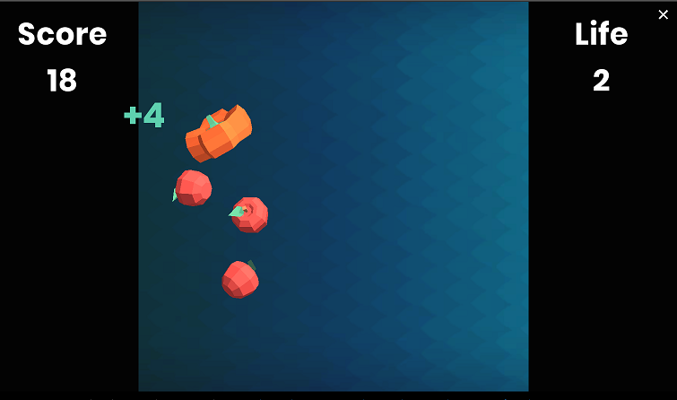

# Clicky Fruit

# Summary

- Genre: arcade
- Platform: browser
- Engine: unity

# Gameplay
- Player click on fruits to get points
- Don't click on fastfoods. 
- Player's only allowed to miss 3 fruits.

## Fruits
-  : +6 point.

-  : +4 point.

-  : +2 point.

## Fastfoods
-  : gameover.

## Screenshots

## Unity Play
[Here](https://play.unity.com/mg/other/clicky-fruit)

## Author
Kiệt

